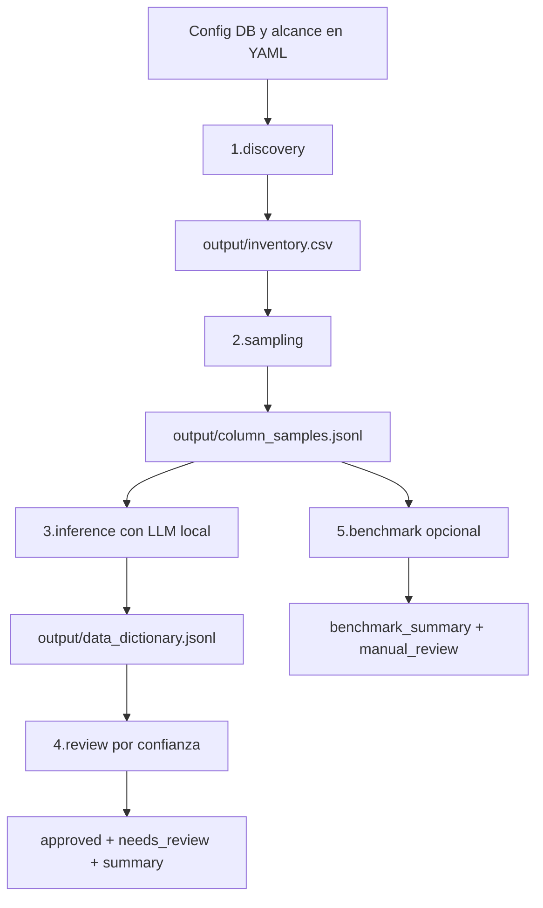

# pg-autometadata

Pipeline para generar un data dictionary asistido por LLM sobre PostgreSQL.

El flujo esta dividido en fases numeradas y configurables por YAML. Se puede ejecutar completo o por etapas, y permite comparar modelos locales para priorizar calidad.

## Objetivo

1. Descubrir tablas y columnas en PostgreSQL.
2. Tomar muestras textuales por columna.
3. Inferir descripcion y significado de negocio con LLM.
4. Separar resultados por confianza.
5. Comparar modelos para elegir el mejor en calidad.

## Requisitos

1. Python 3.10+ (recomendado 3.11 o superior).
2. Acceso de lectura a PostgreSQL.
3. Opcional: endpoint local OpenAI-compatible para inferencia (por ejemplo Ollama u otro servidor compatible).

## Instalacion

Desde la raiz del repo:

```bash
python3 -m venv .venv
source .venv/bin/activate
python -m pip install --upgrade pip
python -m pip install -r requirements.txt
```

Verificacion minima:

```bash
PYTHONPATH=src python run_pipeline.py --help
PYTHONPATH=src python run_benchmark.py --help
```

Nota: los runners Python cargan automaticamente `.env` desde la raiz del repo si existe.

## Estructura del proyecto

```text
.
├── config/
│   ├── phases.yaml
│   ├── connections.yaml
│   ├── discovery.yaml
│   ├── sampling.yaml
│   ├── inference.yaml
│   ├── review.yaml
│   ├── benchmark.yaml
│   └── llm.local.env
├── prompts/
│   └── inference_prompt.txt
├── sql/
│   ├── discovery/
│   └── sampling/
├── src/pg_autometadata/
│   ├── pipeline.py
│   └── benchmark.py
├── run_pipeline.py
├── run_benchmark.py
└── output/
```

## Flujo de fases

Orden definido en config/phases.yaml:

1. 1.discovery
2. 2.sampling
3. 3.inference
4. 4.review
5. 5.benchmark (opcional, disabled por default)

Cada fase define:

1. number: orden de ejecucion
2. value: nombre de la fase
3. enabled: activa o desactiva la fase
4. config: archivo de configuracion de la fase

## Diagrama de uso



## Configuracion

### 1) Conexion a PostgreSQL

Archivo: config/connections.yaml

Tenes dos estrategias:

1. Perfil de conexion (recomendado)
2. URI por variable de entorno

En discovery/sampling, connection.url_env tiene prioridad sobre connection.profile.

Tambien podes definir campos del perfil por variable de entorno para no exponer datos sensibles en git:

1. host_env
2. port_env
3. database_env
4. user_env
5. password_env
6. sslmode_env

Ejemplo rapido con perfil:

```yaml
profiles:
	dev_local:
		host: localhost
		port: 5432
		database: my_database
		user: my_user
		password_env: PGPASSWORD
		sslmode: disable
```

```bash
export PGPASSWORD="tu_password"
```

Ejemplo perfil productivo sin host/user en YAML:

```yaml
profiles:
	db_server:
		host_env: PGHOST
		port_env: PGPORT
		database_env: PGDATABASE
		user_env: PGUSER
		password_env: PGPASSWORD
		sslmode_env: PGSSLMODE
```

### 2) Discovery

Archivo: config/discovery.yaml

Campos clave:

1. scope.include_schemas y scope.exclude_schemas
2. scope.include_relations (table/view)
3. column_type_filters.include_data_types
4. inventory.output_path

Salida esperada: output/inventory.csv

Comportamiento include/exclude schemas:

1. include_schemas con valores: se procesa solo esa lista.
2. include_schemas vacio []: se procesan todos los schemas.
3. exclude_schemas siempre descuenta del resultado anterior.

Ejemplo para procesar todos:

```yaml
scope:
	include_schemas: []
	exclude_schemas:
		- pg_catalog
		- information_schema
```

### 3) Sampling

Archivo: config/sampling.yaml

Campos clave:

1. source.use_inventory_file
2. sampling.sample_size
3. sampling.max_value_length
4. sampling.distinct_preferred
5. runtime.resume

Salida esperada: output/column_samples.jsonl

### 4) Inference

Archivo: config/inference.yaml

Campos clave:

1. llm.mode
2. llm.openai_compatible.endpoint_env
3. llm.openai_compatible.api_key_env
4. llm.openai_compatible.model
5. llm.openai_compatible.temperature
6. runtime.resume

Salida esperada: output/data_dictionary.jsonl

Prompt usado: prompts/inference_prompt.txt

### 5) Review

Archivo: config/review.yaml

Campo clave:

1. review.low_confidence_threshold

Salidas esperadas:

1. output/data_dictionary.approved.jsonl
2. output/data_dictionary.needs_review.jsonl
3. output/review_summary.json

### 6) Benchmark de modelos

Archivo: config/benchmark.yaml

Campos clave:

1. models (lista de modelos a comparar)
2. evaluation.sample_limit
3. evaluation.selection_method
4. evaluation.low_confidence_threshold
5. runtime.resume

Contexto de base en benchmark:

1. `context.database_env` define el nombre de variable de entorno para el nombre de DB del prompt.
2. Si no esta, usa `PGDATABASE`.
3. `context.database` queda como fallback manual.

Nota: esto solo enriquece el prompt del LLM. Benchmark no abre conexion a Postgres.

Salidas esperadas:

1. output/benchmark/predictions_*.jsonl
2. output/benchmark/benchmark_summary.json
3. output/benchmark/benchmark_summary.csv
4. output/benchmark/manual_review.csv

## Reanudar corridas (resume)

Para no perder trabajo si se corta el proceso:

1. sampling, inference y benchmark soportan `runtime.resume: true`.
2. Con resume activo, si el output ya existe, se abre en append y se saltean columnas ya procesadas.
3. La clave de deduplicacion es: schema_name + table_name + column_name.

Comportamiento por fase:

1. discovery: reescribe `output/inventory.csv` completo.
2. sampling: reanuda `output/column_samples.jsonl`.
3. inference: reanuda `output/data_dictionary.jsonl`.
4. review: reescribe salidas de review en base al diccionario actual.
5. benchmark: reanuda por modelo en `output/benchmark/predictions_*.jsonl`.

Si queres corrida limpia desde cero, borra outputs previos o pone `runtime.resume: false`.

## Uso

### Menu interactivo (recomendado)

Para ejecutar todo por pasos desde un menu:

```bash
./scripts/menu.sh
```

Opciones disponibles en el menu:

1. Mostrar entorno actual (.env)
2. Ejecutar fases 1+2
3. Setup LLM local
4. Health check LLM
5. Ejecutar fases 3+4
6. Ejecutar pipeline completo 1..4
7. Ejecutar benchmark
8. Ver carpeta output

### A) Ejecutar pipeline completo (1 a 4)

```bash
PYTHONPATH=src .venv/bin/python run_pipeline.py \
	--root . \
	--phases config/phases.yaml \
	--connections config/connections.yaml
```

### B) Ejecutar solo discovery + sampling

```bash
PYTHONPATH=src .venv/bin/python run_pipeline.py \
	--only 1,2 \
	--connections config/connections.yaml
```

### C) Ejecutar solo inference + review

```bash
PYTHONPATH=src .venv/bin/python run_pipeline.py \
	--only 3,4 \
	--connections config/connections.yaml
```

### D) Ejecutar benchmark de calidad

Primero define endpoint OpenAI-compatible local:

```bash
export LLM_ENDPOINT="http://localhost:11434/v1/chat/completions"
export LLM_API_KEY="local"
```

Luego corre benchmark:

```bash
PYTHONPATH=src .venv/bin/python run_benchmark.py --config config/benchmark.yaml
```

## LLM local listo para levantar (Ollama)

El repo ya incluye scripts para dejar el LLM local operativo sin tocar codigo.

Archivos agregados:

1. config/llm.local.env
2. scripts/llm/setup_ollama.sh
3. scripts/llm/check_ollama_health.sh
4. scripts/llm/run_inference_local.sh

### Paso 1: instalar Ollama (si no lo tenes)

```bash
# macOS
open https://ollama.com/download
```

### Paso 2: setup de modelo local

```bash
./scripts/llm/setup_ollama.sh qwen2.5:14b
```

Este script:

1. valida que ollama exista
2. intenta levantar ollama serve si no responde
3. hace pull del modelo
4. muestra modelos disponibles

### Paso 3: configurar variables LLM locales

```bash
source config/llm.local.env
```

Editar config/llm.local.env si queres otro modelo.

Opcional: si copias esas variables tambien a `.env`, los runners las toman automaticamente.

### Paso 4: health check del servidor local

```bash
source config/llm.local.env
./scripts/llm/check_ollama_health.sh
```

### Paso 5: correr inferencia + review con LLM local

```bash
./scripts/llm/run_inference_local.sh
```

Este script:

1. carga config/llm.local.env
2. actualiza model en config/inference.yaml
3. ejecuta fases 3 y 4

Salida esperada:

1. output/data_dictionary.jsonl
2. output/data_dictionary.approved.jsonl
3. output/data_dictionary.needs_review.jsonl
4. output/review_summary.json

## Recomendacion de modelos (quality-first)

Para este caso de uso, priorizando calidad:

1. qwen2.5:14b (base recomendada)
2. qwen2.5:32b (mejor calidad esperada, mas costo)
3. llama3.1:8b (alternativa robusta)

Si vas a elegir uno, hacelo con benchmark y revision humana, no por velocidad.

## Como elegir el mejor modelo

Usa output/benchmark/manual_review.csv y completa por fila:

1. human_semantic_score_1_to_5
2. human_description_score_1_to_5
3. human_output_format_ok_0_or_1
4. human_final_pass_0_or_1
5. human_comments

Regla sugerida de decision:

1. Maximizar human_final_pass_0_or_1 promedio.
2. Minimizar low_confidence_count.
3. En empate, elegir mayor human_semantic_score_1_to_5.

## Variables de entorno utiles

```bash
# Postgres
export PGHOST="your_db_host"
export PGPORT="5432"
export PGDATABASE="your_db_name"
export PGUSER="your_db_user"
export PGSSLMODE="require"
export PGPASSWORD="tu_password"

# LLM OpenAI-compatible local
export LLM_ENDPOINT="http://localhost:11434/v1/chat/completions"
export LLM_API_KEY="local"
```

## Salidas y contrato minimo

### output/inventory.csv

Columnas principales:

1. schema_name
2. table_name
3. relation_type
4. column_name
5. data_type
6. udt_name

### output/column_samples.jsonl

Registro por columna con samples.

Campos principales:

1. schema_name
2. table_name
3. column_name
4. data_type
5. udt_name
6. samples

### output/data_dictionary.jsonl

Registro inferido por atributo.

Campos principales:

1. schema_name
2. table_name
3. column_name
4. data_type
5. description
6. business_meaning
7. confidence
8. notes

## Troubleshooting

### Error de conexion a Postgres

Checklist:

1. Revisar host, port, database y user en config/connections.yaml.
2. Confirmar variable de password (password_env) exportada.
3. Probar conectividad de red/VPN.

### Seguridad: evitar cambios en DB

Discovery y Sampling tienen protecciones activas para no romper datos:

1. `runtime.enforce_select_only: true`
: permite solo queries SELECT/WITH en SQL de archivo.
2. `runtime.force_read_only_connection: true`
: fuerza la sesion PostgreSQL en modo read-only.

Adicional recomendado:

1. usar un usuario de solo lectura en PostgreSQL (rol sin permisos DDL/DML).

### No aparecen columnas en sampling

Checklist:

1. Revisar include_schemas y exclude_schemas.
2. Revisar include_data_types y exclude_data_types.
3. Verificar que inventory.csv tenga filas.

### Inference cae a fallback heuristico

Significa que fallo endpoint/modelo y se aplico modo seguro.

Checklist:

1. Revisar LLM_ENDPOINT y LLM_API_KEY.
2. Confirmar que el modelo exista en tu servidor local.
3. Validar que el endpoint sea Chat Completions compatible.

### JSON invalido de modelo

El pipeline intenta extraer JSON del texto. Si ves muchos errores:

1. Bajar temperatura a 0.0 o 0.1.
2. Mantener prompt con salida JSON estricta.
3. Reducir max_tokens si el modelo divaga.

## Ejecutar en CI/CD

El pipeline se puede correr en jobs no interactivos.

Ejemplo:

```bash
python -m pip install -r requirements.txt
PYTHONPATH=src python run_pipeline.py --root . --phases config/phases.yaml --connections config/connections.yaml
```

Para CI, usar variables de entorno seguras para credenciales y endpoint LLM.

## Estado actual

1. Pipeline funcional de fases 1 a 4.
2. Benchmark multi-modelo funcional.
3. Configuracion separada y modular por YAML.

Proximo paso recomendado: cargar credenciales reales, correr 1+2, luego benchmark, y finalmente fijar el modelo ganador para inference productiva.
